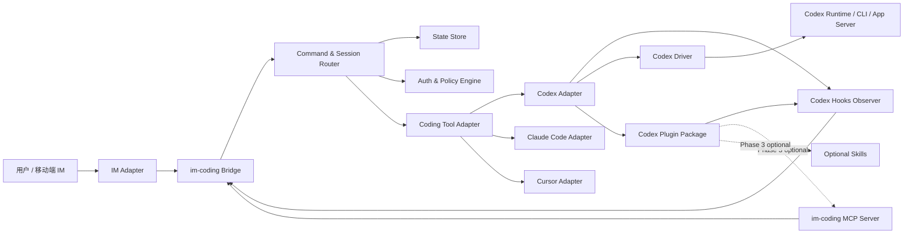

# im-coding 需求与架构设计草案

版本：v0.1  
日期：2026-07-06  
状态：讨论稿

## 1. 背景

`im-coding` 希望打通 IM 与 Coding Agent，让用户可以在移动端 IM 中随时向本机或远端 coding tool 发送消息，并持续收到 agent 的过程输出、最终回复和关键事件通知。

项目优先面向 Codex 桌面端场景，同时预留 Claude Code、Cursor 等 coding tool 的接入能力。目标不是重新实现一个模型对话系统，而是在不改变 coding agent 原有交互体验的前提下，为它增加一个 IM 远程入口和消息同步层。

核心设计原则：

- 模型无感：用户输入、模型输出、工具调用摘要等同步行为应由外部桥接层完成，不能依赖模型主动调用“发送到 IM”的工具。
- 双端可插拔：IM 端和 coding tool 端都通过 adapter/plugin 方式接入。
- IM 优先：IM 通常只有一个聊天框，需要通过指令集实现项目、会话、线程、模式切换等桌面端能力。
- 桌面端一致：远程 IM 操作应尽量复用 Codex 桌面端/CLI 的项目、会话、权限、插件、Skill、Hook、MCP 配置，而不是另建一套孤立 agent。
- 渐进实现：先做可靠的 Codex + 单 IM 闭环，再抽象多 IM、多 coding tool。

## 2. 项目目标

### 2.1 用户目标

用户可以在 IM 中完成以下事情：

- 查看当前连接的 coding agent 状态。
- 选择项目或工作目录。
- 新建对话、继续对话、切换对话。
- 像在 Codex 桌面端一样发送自然语言任务。
- 接收 agent 的阶段性输出、最终回复、错误、权限请求和完成通知。
- 在移动端对权限请求或高风险动作做确认。
- 查看会话列表、最近任务、项目状态和执行日志摘要。

### 2.2 系统目标

系统需要支持：

- 可插拔 IM adapter，Phase 1 优先实现 Lark/飞书，后续再扩展企业微信、Telegram、Slack、Discord、钉钉等。
- 可插拔 coding tool adapter，例如 Codex、Claude Code、Cursor，优先 Codex。
- 统一消息模型：把 IM 消息、agent 输入、agent 输出、工具事件映射为内部 event。
- 统一会话模型：支持 project、thread/conversation、turn、message、run、artifact。
- 可靠投递：消息去重、重试、ack、断点恢复。
- 权限与安全：身份绑定、项目访问控制、命令白名单、敏感输出脱敏。
- 插件化分发：Codex 场景优先考虑以 Codex Plugin 打包 Hook 和安装配置；MCP server、Skill 仅作为后续可选增强。

## 3. 非目标

第一阶段不做：

- 不重新训练或包装模型，不改变 coding agent 的核心推理流程。
- 不把 IM 做成完整 IDE；文件编辑、diff 查看和复杂审批仍以 Codex 桌面端/CLI 为主。
- 不强依赖某个 IM 平台的私有能力，IM adapter 必须可替换。
- 不假设 Codex 桌面端内部私有数据结构稳定可依赖。
- 不直接读取或修改用户不授权的项目、凭据、会话历史。

## 4. 关键判断：MCP、Skill、Plugin、Hook 的职责边界

### 4.1 推荐边界

| 能力 | 适合做什么 | 不适合做什么 |
| --- | --- | --- |
| Hook | 监听 Codex 生命周期事件，捕获用户输入、会话停止、工具调用后事件，并把事件推送给 im-coding bridge | 作为复杂业务逻辑主进程 |
| Plugin | 打包 Hook、安装配置、可选 MCP/Skill，方便 Codex 用户安装和启用 | 直接承载跨 IM 的长期运行服务 |
| MCP | 可选增强：让 Codex 在模型主动需要时读取/操作 im-coding 资源，例如查询 IM 上下文、拉取项目列表、生成待发送报告 | 承担模型无感的自动转发主链路 |
| Skill | 可选增强：给 Codex 提供可复用工作流，例如“将当前任务整理成 IM 周报” | 捕获每一轮输入输出，或保证消息同步 |
| 外部 Bridge 服务 | 维护 IM 连接、会话状态、消息路由、重试、权限审批、adapter 管理 | 替代 coding agent 本身 |

### 4.2 为什么 MCP/Skill 不是核心链路

本项目的核心诉求是模型无感：用户在 Codex 桌面端或 IM 中输入，agent 的输出自动同步到飞书；模型不需要知道“现在要转发到飞书”，也不需要在每轮对话里主动调用工具。

因此：

- 不用 MCP 做主链路：MCP 是给模型暴露工具和上下文的协议，适合“模型主动决定调用某个工具”。但自动同步输入输出应该由 Hook/Bridge 完成，否则会让消息投递依赖模型行为，可靠性和一致性都不够。
- 不用 Skill 做主链路：Skill 是给模型加载工作流说明的机制，适合规范某类任务怎么做。它不能稳定拦截每轮用户输入、模型输出和工具事件。
- 保留 Plugin：Plugin 仍然有价值，因为 Codex plugin 可以打包 Hook、配置和后续可选能力。对用户来说，它是安装 im-coding Codex 侧集成的分发方式。
- 保留 MCP/Skill 的位置：它们可以放到 Phase 3，用于增强能力，而不是 Phase 1 的必要依赖。例如让模型主动查询“飞书里最近的审批结果”、把当前会话整理成飞书汇报、读取某个飞书消息上下文等。

### 4.3 Codex 优先路径

Codex 当前可用的公开扩展面包括：

- `config.toml` / `.codex/config.toml`：配置 MCP、Hook、项目级设置。
- Hook 事件：`SessionStart`、`UserPromptSubmit`、`PostToolUse`、`Stop` 等可用于监听会话生命周期。Hook 输入中包含 `session_id`、`turn_id`、`cwd`、`transcript_path` 等字段，但 transcript 格式不应视为稳定接口。
- Plugin：可打包 `hooks/`、`skills/`、`.mcp.json`、`.app.json`，并通过 `.codex-plugin/plugin.json` 描述；Phase 1 只要求打包 Hook 和基础安装配置。
- MCP：适合暴露 im-coding 的查询和动作工具给 Codex，但不作为自动转发主链路。

因此 Codex adapter 推荐分两层：

- Codex Observer：基于 Hook 捕获输入/输出/状态，推送到 bridge。
- Codex Driver：负责从 IM 触发 Codex 新建会话、继续会话、提交用户输入。Driver 的具体实现需要优先验证 Codex CLI/SDK/App Server/可用线程 API，避免依赖桌面端私有 UI 自动化。

## 5. 总体架构



### 5.1 核心模块

#### IM Adapter

职责：

- 接收 IM 消息、按钮点击、审批回调、文件上传。
- 发送文本、富文本、卡片、文件、图片。
- 处理 IM 平台签名校验、token 刷新、限流和重试。

第一阶段选择飞书做 MVP。其他 IM 通过 adapter 接口预留，等飞书链路跑通后再扩展。

#### Bridge

职责：

- 提供统一 HTTP/WebSocket/Queue 接口。
- 接收 IM 入站事件和 coding tool 出站事件。
- 做消息去重、事件持久化、重试、ack。
- 管理 adapter 生命周期。

#### Command & Session Router

职责：

- 解析 IM 单聊天框中的指令。
- 把自然语言消息路由到当前 project/thread。
- 管理项目、会话、运行中的 turn。
- 维护“当前上下文”，例如当前项目、当前会话、当前模式。

#### Coding Tool Adapter

职责：

- 抽象不同 coding tool 的会话能力。
- 提供统一接口：`listProjects`、`listThreads`、`createThread`、`resumeThread`、`sendMessage`、`cancelRun`、`getStatus`。
- 把 tool 的输出事件标准化为 `AgentEvent`。

#### State Store

职责：

- 保存用户绑定、项目映射、会话映射、消息映射、权限状态。
- 保存事件游标，用于断线恢复。
- 保存 adapter 配置，但敏感凭据需要使用系统 keychain 或独立 secret store。

#### Policy Engine

职责：

- 控制哪些 IM 用户可以访问哪些项目。
- 控制哪些指令允许远程执行。
- 对敏感命令、文件修改、网络访问、凭据相关输出做审批或脱敏。
- 管理移动端审批超时、默认拒绝策略。

## 6. 会话与消息模型

### 6.1 概念模型

- Workspace：一个 im-coding 实例，可绑定多个 coding tool 和 IM。
- Project：一个代码项目或工作目录。
- Thread：coding agent 的对话/会话。
- Turn：用户一次输入到 agent 完成回复的过程。
- Message：用户、agent、系统、工具事件的统一消息。
- Run：一次正在执行的 agent 任务，可暂停、取消、完成、失败。
- Binding：IM 用户/群聊与 workspace/project/thread 的绑定关系。

### 6.2 数据模型草案

```ts
type Project = {
  id: string;
  name: string;
  rootPath: string;
  codingTool: "codex" | "claude-code" | "cursor";
  status: "active" | "archived" | "unavailable";
};

type Thread = {
  id: string;
  projectId: string;
  externalThreadId?: string;
  title: string;
  status: "idle" | "running" | "waiting_approval" | "failed" | "completed";
  createdAt: string;
  updatedAt: string;
};

type Message = {
  id: string;
  threadId: string;
  turnId?: string;
  source: "im" | "agent" | "hook" | "system" | "tool";
  role: "user" | "assistant" | "system" | "tool";
  content: string;
  contentType: "text" | "markdown" | "file" | "image" | "event";
  externalMessageId?: string;
  createdAt: string;
};

type AgentEvent = {
  id: string;
  projectId: string;
  threadId: string;
  turnId?: string;
  eventType:
    | "session_started"
    | "user_prompt_submitted"
    | "assistant_delta"
    | "assistant_final"
    | "tool_started"
    | "tool_finished"
    | "permission_requested"
    | "run_finished"
    | "run_failed";
  payload: Record<string, unknown>;
  createdAt: string;
};
```

## 7. IM 单聊天框交互设计

### 7.1 交互原则

- 无指令的普通文本默认发送给“当前项目 + 当前会话”。
- 指令以 `/` 开头，避免和自然语言混淆。
- 高频操作使用短指令，低频管理操作可以用完整指令。
- 所有会话切换都需要在 IM 中明确回显当前上下文。
- 群聊场景默认需要 `@bot` 或绑定专属 thread，避免误触发。

### 7.2 指令草案

| 指令 | 作用 | 示例 |
| --- | --- | --- |
| `/help` | 查看可用指令 | `/help` |
| `/status` | 查看当前 agent、项目、会话状态 | `/status` |
| `/projects` | 列出可用项目 | `/projects` |
| `/use <project>` | 切换当前项目 | `/use im-coding` |
| `/new [title]` | 在当前项目中新建会话 | `/new 修复登录 bug` |
| `/threads` | 查看当前项目最近会话 | `/threads` |
| `/switch <thread>` | 切换会话 | `/switch 3` |
| `/rename <title>` | 重命名当前会话 | `/rename IM 远程控制设计` |
| `/cancel` | 取消当前运行 | `/cancel` |
| `/approve <id>` | 批准权限请求 | `/approve p123` |
| `/deny <id>` | 拒绝权限请求 | `/deny p123` |
| `/mode <mode>` | 切换执行模式 | `/mode plan` |
| `/summary` | 获取当前会话摘要 | `/summary` |
| `/files` | 查看最近产物或修改文件 | `/files` |

### 7.3 上下文回显示例

用户：

```text
/use im-coding
```

机器人：

```text
当前项目：im-coding
当前会话：未选择
发送 /new 创建新会话，或 /threads 查看最近会话。
```

用户：

```text
/new Codex + IM 架构设计
```

机器人：

```text
已创建会话：Codex + IM 架构设计
现在可以直接发送任务内容。
```

用户：

```text
帮我补一版需求文档，重点考虑 Codex hook 和 IM 单聊天框指令。
```

机器人：

```text
已发送到 Codex。
项目：im-coding
会话：Codex + IM 架构设计
状态：运行中
```

## 8. Codex Adapter 设计

### 8.1 Codex Observer

基于 Hook 捕获事件：

- `SessionStart`：同步会话启动、cwd、session_id。
- `UserPromptSubmit`：同步用户输入事件。
- `PostToolUse`：同步工具调用完成事件，可摘要发送到 IM。
- `Stop`：同步最终回复或运行完成状态。

注意：

- Hook 输入可提供 `transcript_path`，但官方说明 transcript 格式不稳定，因此只能作为短期兼容方案；需要封装 parser，并准备失败降级。
- Hook 脚本应尽量轻量，只负责把事件投递给本地 bridge，例如 `http://127.0.0.1:<port>/codex/hooks`。
- Hook 失败不能影响 Codex 主流程；bridge 不可用时应本地缓冲。

### 8.2 Codex Driver

需要验证的候选方案：

1. Codex CLI / non-interactive / SDK / App Server：优先验证是否能创建、恢复、发送消息到指定会话。
2. Codex 桌面端 thread 管理能力：若有公开 API 或 App Server 能力，优先使用。
3. UI 自动化：作为最后兜底，不作为 MVP 的核心依赖。

Driver 接口草案：

```ts
interface CodingToolDriver {
  listProjects(): Promise<Project[]>;
  listThreads(projectId: string): Promise<Thread[]>;
  createThread(input: { projectId: string; title?: string }): Promise<Thread>;
  sendMessage(input: { threadId: string; content: string }): Promise<void>;
  cancelRun(input: { threadId: string; runId?: string }): Promise<void>;
  getStatus(input: { threadId: string }): Promise<Thread["status"]>;
}
```

### 8.3 Codex Plugin 包结构草案

```text
im-coding-codex-plugin/
  .codex-plugin/
    plugin.json
  hooks/
    hooks.json
    codex_hook_forwarder.js
  skills/                  # Phase 3 optional
    im-coding/
      SKILL.md
  .mcp.json                # Phase 3 optional
  assets/
    icon.png
```

`plugin.json` 职责：

- 声明插件名、版本、描述。
- Phase 1 只要求指向 `hooks`。
- Phase 3 可继续指向 `skills`、`mcpServers`。
- 提供安装界面展示信息。

`hooks.json` 职责：

- 注册 `SessionStart`、`UserPromptSubmit`、`PostToolUse`、`Stop`。

`.mcp.json` 职责，Phase 3 optional：

- 暴露 im-coding MCP server 给 Codex，用于查询飞书上下文、读取项目/会话状态、获取远程审批状态等。
- 不负责常规输入输出转发。

`SKILL.md` 职责，Phase 3 optional：

- 只描述需要模型主动执行的工作流，例如“把当前会话整理成适合发到飞书的状态报告”。
- 不承担常规输入输出转发。

## 9. IM Adapter 设计

### 9.1 Adapter 接口

```ts
interface ImAdapter {
  name: string;
  start(): Promise<void>;
  stop(): Promise<void>;
  sendMessage(input: SendMessageInput): Promise<SendMessageResult>;
  sendCard?(input: SendCardInput): Promise<SendMessageResult>;
  onMessage(handler: (event: ImInboundEvent) => Promise<void>): void;
  onAction?(handler: (event: ImActionEvent) => Promise<void>): void;
}
```

### 9.2 Phase 1 飞书 Adapter

Phase 1 默认实现飞书 adapter。

选择理由：

- 移动端使用体验好，适合“随时给 coding agent 发消息”的主场景。
- 机器人、消息卡片、按钮回调、文件能力较完整，适合后续做权限审批和任务状态卡片。
- 国内团队协作场景更自然，后续可以扩展到群聊项目协作。

Phase 1 必需能力：

- 接收用户私聊消息。
- 发送文本/Markdown 风格消息。
- 识别飞书用户身份，并与本地 workspace 用户绑定。
- 支持基础指令：`/help`、`/projects`、`/use`、`/new`、`/threads`、`/switch`、`/status`、`/cancel`。
- 支持长消息分片。

Phase 2 增强能力：

- 发送飞书消息卡片。
- 卡片按钮审批：批准、拒绝、取消任务。
- 文件上传/下载，用于传递日志、patch、报告等 artifact。
- 群聊模式与 `@bot` 触发。

## 10. 权限与安全

### 10.1 身份绑定

- 单聊：IM user id 绑定本地 workspace user。
- 群聊：chat id + user id 双重判断，默认只有白名单用户可触发。
- 项目访问：每个 project 配置允许的 IM 用户/群。

### 10.2 高风险动作

以下事件需要审批或明确配置：

- 执行 shell 命令。
- 修改大量文件。
- 删除文件。
- 访问外部网络。
- 读取敏感路径或凭据文件。
- 推送代码、发起 PR、部署上线。

### 10.3 IM 审批

权限请求在 IM 中表现为：

```text
Codex 请求执行命令：
项目：im-coding
会话：修复 adapter
命令：npm test

回复 /approve p123 批准，或 /deny p123 拒绝。
```

未来可升级为 IM 卡片按钮。

## 11. 可靠性设计

- 所有入站 IM 消息以 `externalMessageId` 去重。
- 所有出站 IM 消息记录发送状态，失败后指数退避重试。
- Bridge 与 Hook 之间本地优先，避免公网依赖影响 Codex。
- Hook forwarder 在 bridge 不可用时写入本地队列文件，bridge 恢复后补发。
- 每个 turn 有状态机：`created -> sent -> running -> waiting_approval -> completed/failed/cancelled`。
- 长输出需要分片发送，并保留完整 markdown 到本地 artifact。

## 12. 开发路线

### Phase 0：验证 Codex 能力边界

目标：明确 Codex Driver 可用路径。

任务：

- 验证 Codex Hook 事件 payload，尤其 `UserPromptSubmit`、`Stop`、`PostToolUse`。
- 验证 Codex 是否能通过 CLI/SDK/App Server 创建/恢复会话并发送消息。
- 验证 plugin-bundled hooks 的安装、信任和启用流程。
- 明确 transcript parser 的可用范围和降级策略。

产出：

- `docs/codex-capability-spike.md`
- 最小 hook forwarder demo。

### Phase 1：飞书 + Codex MVP

目标：在飞书私聊中完成项目选择、新建会话、发送消息、接收回复。

范围：

- 飞书 IM adapter。
- Bridge HTTP 服务。
- SQLite 本地存储。
- Codex Hook Observer。
- Codex Driver 最小实现。
- 指令：`/help`、`/projects`、`/use`、`/new`、`/threads`、`/switch`、`/status`、`/cancel`。

验收：

- 用户可在 IM 新建 Codex 会话并发送任务。
- Codex 最终回复会自动回到飞书。
- 切换会话后普通消息进入正确 thread。
- bridge 重启后最近会话状态可恢复。

### Phase 2：权限审批与过程事件

目标：把远程使用变得安全可控。

范围：

- 权限请求 IM 通知。
- `/approve`、`/deny`。
- 飞书卡片按钮审批。
- 工具调用摘要。
- 长输出分片。
- 错误与超时处理。

验收：

- 高风险动作可在 IM 中确认。
- 执行失败时 IM 可收到清晰错误。
- 过程事件不会刷屏，默认折叠为摘要。

### Phase 3：插件化与多 adapter

目标：形成可安装、可扩展的 im-coding，并按需补充 MCP/Skill 增强能力。

范围：

- Codex plugin package。
- 可选 MCP server。
- 第二个 IM adapter。
- 第二个 coding tool adapter。
- 配置文件和安装向导。

验收：

- 用户可通过插件安装 Codex 侧 Hook；如启用增强能力，也可安装 MCP/Skill。
- 新增 IM adapter 不需要修改核心 router。
- 新增 coding tool adapter 不需要修改 IM adapter。

## 13. 配置草案

```yaml
server:
  host: 127.0.0.1
  port: 4399

store:
  type: sqlite
  path: ~/.im-coding/im-coding.db

imAdapters:
  - type: lark
    name: personal-lark
    enabled: true
    configRef: lark-personal

codingTools:
  - type: codex
    name: local-codex
    enabled: true
    projects:
      - id: im-coding
        name: im-coding
        rootPath: /Users/smzdm/project/work/im-coding

bindings:
  - imAdapter: personal-lark
    imUserId: "<user-open-id>"
    allowedProjects: ["im-coding"]
    defaultProject: im-coding
```

## 14. 需要继续讨论的问题

1. Codex Driver 路径：优先验证 CLI/SDK/App Server，还是直接以桌面端当前线程为主？
2. 移动端权限：哪些动作必须二次确认，哪些可以沿用 Codex 本地权限模式？
3. 飞书输出粒度：只发最终回复，还是发送阶段性思考、工具调用、文件变更摘要？
4. 飞书群聊支持：第一阶段只支持个人单聊，还是 Phase 2 支持群聊中的多用户协作？
5. 会话映射：飞书单聊与 Codex thread 是一对一，还是允许一个飞书 chat 下切换多个 Codex thread？
6. 多 coding tool：Claude Code/Cursor 放到 Phase 3，还是需要从一开始定义兼容层测试桩？
7. 部署形态：本机常驻服务、Docker、LaunchAgent、还是云端 relay + 本机 agent？

## 15. 官方能力参考

本草案基于 2026-07-06 可查的 Codex 官方文档和当前环境能力做初步判断：

- Codex Plugin 可打包 skills、hooks、MCP servers、app mappings；本项目 Phase 1 只需要 Hook 和安装配置。
- Codex Hook 支持从配置或插件中加载，并提供 `SessionStart`、`UserPromptSubmit`、`PostToolUse`、`Stop` 等事件。
- Hook 输入包含 `session_id`、`transcript_path`、`cwd`、`hook_event_name`、`model` 等公共字段；其中 transcript 格式不稳定，不能作为长期稳定协议。
- MCP 适合连接外部工具和上下文，支持 STDIO 与 Streamable HTTP server；在本项目中属于可选增强，不承担自动转发主链路。
- Skill 适合封装重复工作流，不适合作为模型无感的每轮消息同步机制。

参考链接：

- https://developers.openai.com/codex/plugins
- https://developers.openai.com/codex/plugins/build
- https://developers.openai.com/codex/hooks
- https://developers.openai.com/codex/mcp
- https://developers.openai.com/codex/concepts/customization
