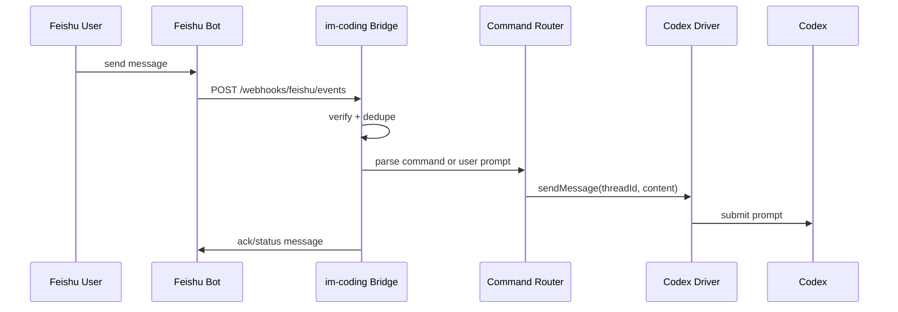
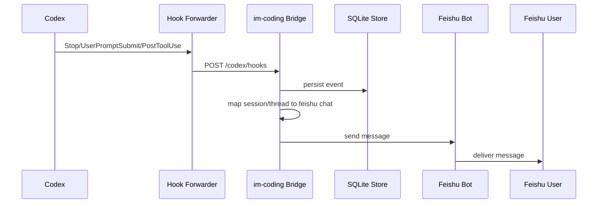

# Spec 001：飞书 + Codex 最小闭环

版本：v0.1  
日期：2026-07-06  
状态：Draft  
关联需求：[im-coding 需求与架构设计草案](./im-coding-requirements.md)

## 1. 目标

实现 `im-coding` 的第一个可运行闭环：

```text
飞书私聊消息 -> im-coding Bridge -> Codex Driver -> Codex
Codex Hook -> im-coding Bridge -> 飞书私聊消息
```

用户可以在飞书私聊中选择项目、新建会话、发送任务，并在飞书中收到 Codex 的最终回复和基础状态通知。

本 spec 明确不把 MCP/Skill 放进主链路。MCP/Skill 属于 Phase 3 optional enhancement；Phase 1 只需要 Bridge、飞书 Adapter、Codex Driver、Codex Hook Observer。

## 2. 范围

### 2.1 In Scope

- 飞书私聊接入。
- 本地 Bridge HTTP 服务。
- 本地 SQLite 状态存储。
- 用户身份绑定。
- 项目选择。
- 会话新建、列表、切换。
- 普通飞书文本消息转发给当前 Codex 会话。
- Codex Hook 捕获会话事件，并把最终结果同步回飞书。
- 基础指令集：
  - `/help`
  - `/status`
  - `/projects`
  - `/use <project>`
  - `/new [title]`
  - `/threads`
  - `/switch <thread>`
  - `/cancel`
- 长消息分片发送。
- 基础幂等：飞书消息去重，Hook 事件去重。

### 2.2 Out of Scope

- 飞书群聊。
- 飞书消息卡片和按钮审批。
- 文件上传/下载。
- MCP server。
- Skill。
- 多 IM adapter。
- Claude Code/Cursor adapter。
- 云端 relay。
- 完整权限审批流。
- 复杂 diff、patch、artifact 展示。

## 3. 成功标准

MVP 成功的判断：

- 用户在飞书私聊发送 `/projects`，能看到本地配置的项目列表。
- 用户发送 `/use im-coding` 后，当前上下文切换到该项目。
- 用户发送 `/new 需求文档` 后，系统创建一个本地 thread 记录，并准备好 Codex 会话。
- 用户发送普通文本后，Bridge 能调用 Codex Driver，把消息提交给 Codex。
- Codex 完成后，Hook Observer 能把最终回复发送回同一个飞书私聊。
- 重复收到同一条飞书事件不会重复触发 Codex。
- Bridge 重启后，用户仍能 `/status` 查看当前绑定、项目、会话状态。

## 4. 用户体验

### 4.1 首次使用

用户在飞书私聊发送：

```text
/help
```

机器人回复：

```text
im-coding 已连接。

常用指令：
/projects 查看项目
/use <project> 切换项目
/new [title] 新建会话
/threads 查看会话
/switch <thread> 切换会话
/status 查看当前状态
/cancel 取消当前运行
```

### 4.2 选择项目

用户：

```text
/projects
```

机器人：

```text
可用项目：
1. im-coding
   /use im-coding
```

用户：

```text
/use im-coding
```

机器人：

```text
当前项目：im-coding
当前会话：未选择
发送 /new 创建会话，或 /threads 查看最近会话。
```

### 4.3 新建会话并发送任务

用户：

```text
/new 飞书 Codex 
```

机器人：

```text
已创建会话：飞书 Codex 
项目：im-coding
现在可以直接发送任务内容。
```

用户：

```text
帮我补一个 Bridge 的接口设计。
```

机器人：

```text
已发送到 Codex。
项目：im-coding
会话：飞书 Codex 
状态：运行中
```

Codex 完成后，机器人回复：

```text
Codex 已完成。

<Codex 最终回复内容>
```

## 5. 核心设计

### 5.1 进程组成

```text
im-coding server
  ├─ Bridge HTTP API
  ├─ Feishu Adapter
  ├─ Command Router
  ├─ Session Router
  ├─ Codex Driver
  ├─ Codex Hook Receiver
  └─ SQLite Store

Codex side
  └─ Hook forwarder
```

### 5.2 消息流

#### 飞书到 Codex



#### Codex 到飞书



## 6. 模块规格

### 6.1 Feishu Adapter

职责：

- 接收飞书事件回调。
- 解析私聊文本消息。
- 发送文本消息。
- 处理飞书 challenge/verification。
- 根据飞书 `message_id` 做入站去重。
- 根据飞书 user id 做身份绑定。

Phase 1 只支持：

- 私聊。
- 文本消息。
- 机器人回复文本。

Phase 1 不支持：

- 群聊。
- 卡片。
- 文件。
- 图片。
- 富文本编辑。

### 6.2 Bridge HTTP API

#### `GET /health`

用途：健康检查。

响应：

```json
{
  "ok": true,
  "service": "im-coding",
  "version": "0.1.0"
}
```

#### `POST /webhooks/feishu/events`

用途：接收飞书事件。

处理要求：

- 验证请求来源。
- 处理飞书 URL verification。
- 只接受配置允许的 app/bot。
- 去重 `external_event_id` 或 `message_id`。
- 转换为内部 `ImInboundEvent`。

内部事件：

```ts
type ImInboundEvent = {
  id: string;
  adapter: "feishu";
  eventType: "message_received";
  externalEventId: string;
  externalMessageId: string;
  chatType: "private";
  chatId: string;
  senderId: string;
  text: string;
  raw: unknown;
  receivedAt: string;
};
```

#### `POST /codex/hooks`

用途：接收 Codex Hook forwarder 发来的事件。

请求：

```ts
type CodexHookEvent = {
  id: string;
  hookEventName: "SessionStart" | "UserPromptSubmit" | "PostToolUse" | "Stop";
  sessionId: string;
  turnId?: string;
  cwd?: string;
  transcriptPath?: string;
  model?: string;
  payload: Record<string, unknown>;
  createdAt: string;
};
```

处理要求：

- 根据 `sessionId` 或 `cwd` 映射本地 thread。
- 持久化 hook event。
- `Stop` 事件触发最终回复提取和飞书发送。
- 读取 transcript 失败时，发送保底状态消息。

#### `POST /internal/feishu/send`

用途：内部调试或测试发送飞书消息。

请求：

```ts
type SendFeishuMessageRequest = {
  chatId: string;
  text: string;
};
```

## 7. Router 规格

### 7.1 上下文选择规则

每个飞书私聊维护一个当前上下文：

```ts
type ChatContext = {
  adapter: "feishu";
  chatId: string;
  userId: string;
  currentProjectId?: string;
  currentThreadId?: string;
  updatedAt: string;
};
```

普通文本路由规则：

- 没有当前项目：提示先执行 `/projects` 和 `/use <project>`。
- 有当前项目但没有当前会话：提示先执行 `/new` 或 `/threads`。
- 当前会话 `running`：默认拒绝新输入，提示等待或 `/cancel`。
- 当前会话 `idle`/`completed`：提交给 Codex Driver。

### 7.2 指令行为

#### `/status`

返回：

- 当前飞书用户绑定状态。
- 当前项目。
- 当前会话。
- 当前运行状态。
- Bridge 状态。

#### `/projects`

返回当前用户有权限访问的项目。

#### `/use <project>`

切换当前项目，清空当前会话或保留该项目上次使用会话。Phase 1 默认清空当前会话，避免误发。

#### `/new [title]`

在当前项目中创建 thread。

Phase 1 行为：

- 创建本地 thread。
- 调用 Codex Driver 创建或准备 Codex 会话。
- 将飞书 chat 绑定到该 thread。

#### `/threads`

列出当前项目最近 10 个 thread。

#### `/switch <thread>`

切换当前会话。

`<thread>` 支持：

- `/threads` 列表里的序号。
- thread id 前缀。

#### `/cancel`

取消当前运行。

Phase 1 若 Codex Driver 暂不支持取消，则标记为 `cancel_requested`，并回复：

```text
已记录取消请求。当前 Codex Driver 暂不支持强制中断，请在桌面端确认任务状态。
```

## 8. Codex 集成规格

### 8.1 Codex Driver

Driver 接口：

```ts
interface CodexDriver {
  createThread(input: {
    projectId: string;
    projectPath: string;
    title?: string;
  }): Promise<{ externalThreadId?: string; sessionId?: string }>;

  sendMessage(input: {
    projectId: string;
    projectPath: string;
    threadId: string;
    externalThreadId?: string;
    content: string;
  }): Promise<{ runId: string; sessionId?: string }>;

  cancelRun(input: {
    threadId: string;
    runId?: string;
  }): Promise<{ cancelled: boolean; reason?: string }>;
}
```

Phase 1 需要先做 Codex Driver spike，确定提交消息的具体实现：

- 优先：Codex CLI / Codex App Server / 官方可用线程接口。
- 次选：CLI non-interactive 模式，先实现“新消息触发新 run，最终回复回流”。
- 兜底：桌面 UI 自动化只作为实验路径，不进入稳定 MVP。

### 8.2 Codex Hook Forwarder

Hook forwarder 是 Codex 侧轻量脚本，职责只有一个：把 Codex hook payload 转发给 Bridge。

要求：

- 不做复杂业务判断。
- Bridge 不可用时写入本地 pending queue。
- 不阻塞 Codex 主流程。
- 不依赖模型主动调用。

环境变量：

```text
IM_CODING_BRIDGE_URL=http://127.0.0.1:4399
IM_CODING_HOOK_TOKEN=<local-token>
```

转发目标：

```text
POST http://127.0.0.1:4399/codex/hooks
```

### 8.3 最终回复提取

Phase 1 策略：

- 优先从 Hook payload 中读取可用摘要或最终消息。
- 若 Hook payload 不包含最终文本，则尝试读取 `transcriptPath`。
- 若 transcript 读取失败或格式不兼容，则发送保底消息：

```text
Codex 已结束，但 im-coding 暂未能提取最终回复。
请在 Codex 桌面端查看完整结果。
```

注意：transcript 格式不视为稳定协议，parser 必须隔离在 `CodexTranscriptReader` 模块中。

## 9. 数据模型

### 9.1 Tables

#### `users`

```sql
CREATE TABLE users (
  id TEXT PRIMARY KEY,
  display_name TEXT,
  created_at TEXT NOT NULL,
  updated_at TEXT NOT NULL
);
```

#### `im_bindings`

```sql
CREATE TABLE im_bindings (
  id TEXT PRIMARY KEY,
  user_id TEXT NOT NULL,
  adapter TEXT NOT NULL,
  external_user_id TEXT NOT NULL,
  external_chat_id TEXT NOT NULL,
  created_at TEXT NOT NULL,
  updated_at TEXT NOT NULL,
  UNIQUE(adapter, external_user_id, external_chat_id)
);
```

#### `projects`

```sql
CREATE TABLE projects (
  id TEXT PRIMARY KEY,
  name TEXT NOT NULL,
  root_path TEXT NOT NULL,
  coding_tool TEXT NOT NULL,
  status TEXT NOT NULL,
  created_at TEXT NOT NULL,
  updated_at TEXT NOT NULL
);
```

#### `threads`

```sql
CREATE TABLE threads (
  id TEXT PRIMARY KEY,
  project_id TEXT NOT NULL,
  title TEXT NOT NULL,
  external_thread_id TEXT,
  codex_session_id TEXT,
  status TEXT NOT NULL,
  created_at TEXT NOT NULL,
  updated_at TEXT NOT NULL
);
```

#### `chat_contexts`

```sql
CREATE TABLE chat_contexts (
  id TEXT PRIMARY KEY,
  adapter TEXT NOT NULL,
  external_chat_id TEXT NOT NULL,
  external_user_id TEXT NOT NULL,
  current_project_id TEXT,
  current_thread_id TEXT,
  updated_at TEXT NOT NULL,
  UNIQUE(adapter, external_chat_id, external_user_id)
);
```

#### `messages`

```sql
CREATE TABLE messages (
  id TEXT PRIMARY KEY,
  thread_id TEXT,
  source TEXT NOT NULL,
  role TEXT NOT NULL,
  content TEXT NOT NULL,
  external_message_id TEXT,
  created_at TEXT NOT NULL
);
```

#### `events`

```sql
CREATE TABLE events (
  id TEXT PRIMARY KEY,
  source TEXT NOT NULL,
  event_type TEXT NOT NULL,
  external_event_id TEXT,
  payload_json TEXT NOT NULL,
  created_at TEXT NOT NULL,
  UNIQUE(source, external_event_id)
);
```

#### `runs`

```sql
CREATE TABLE runs (
  id TEXT PRIMARY KEY,
  thread_id TEXT NOT NULL,
  status TEXT NOT NULL,
  codex_session_id TEXT,
  started_at TEXT NOT NULL,
  finished_at TEXT
);
```

## 10. 配置

配置文件路径：

```text
~/.im-coding/config.yaml
```

示例：

```yaml
server:
  host: 127.0.0.1
  port: 4399
  hookTokenEnv: IM_CODING_HOOK_TOKEN

store:
  type: sqlite
  path: ~/.im-coding/im-coding.db

feishu:
  enabled: true
  appIdEnv: FEISHU_APP_ID
  appSecretEnv: FEISHU_APP_SECRET
  verificationTokenEnv: FEISHU_VERIFICATION_TOKEN
  encryptKeyEnv: FEISHU_ENCRYPT_KEY

projects:
  - id: im-coding
    name: im-coding
    rootPath: /Users/smzdm/project/work/im-coding
    codingTool: codex

access:
  allowedFeishuUsers:
    - "<open_id_or_user_id>"
```

## 11. 错误处理

### 11.1 用户未授权

回复：

```text
你还没有被授权使用 im-coding。
请联系管理员把你的飞书 user id 加入 allowedFeishuUsers。
```

### 11.2 未选择项目

回复：

```text
还没有选择项目。
发送 /projects 查看项目，然后使用 /use <project> 切换。
```

### 11.3 未选择会话

回复：

```text
当前项目还没有选择会话。
发送 /new 创建新会话，或 /threads 查看最近会话。
```

### 11.4 Codex Driver 不可用

回复：

```text
Codex 暂时不可用。
请确认 Codex 已安装、已登录，并且 im-coding Bridge 正在运行。
```

### 11.5 飞书发送失败

处理：

- 记录 `messages` 发送失败状态。
- 重试 3 次。
- 仍失败则记录 error event。
- 不重复触发 Codex run。

## 12. 幂等与可靠性

- 飞书入站事件用 `source=feishu + external_event_id/message_id` 去重。
- Codex Hook 事件用 `source=codex_hook + event_id` 去重。
- `sendMessage` 创建 run 前必须写入 message 和 run，避免进程崩溃后丢状态。
- Bridge 启动时扫描 `runs.status = running` 的记录，标记为 `unknown`，并在 `/status` 中提示用户到 Codex 桌面端确认。
- 飞书长消息按最大长度分片，分片前缀使用 `[1/3]`、`[2/3]`。

## 13. 开发任务拆分

### Task 1：项目骨架

- 初始化运行时项目。
- 提供 `im-coding server` 命令。
- 读取 config。
- 提供 `GET /health`。

验收：

- 本地启动服务。
- `curl http://127.0.0.1:4399/health` 返回 ok。

### Task 2：SQLite Store

- 初始化数据库。
- 实现 migration。
- 实现 project、thread、context、event、message、run repository。

验收：

- 启动时自动创建数据库。
- 可从 config seed projects。

### Task 3：Command Router

- 实现基础指令 parser。
- 实现 `/help`、`/status`、`/projects`、`/use`、`/new`、`/threads`、`/switch`、`/cancel`。
- 提供本地 mock inbound event 测试入口。

验收：

- 不接飞书也能用 mock event 跑通指令。

### Task 4：Feishu Adapter

- 接收飞书 webhook。
- 验证请求。
- 解析私聊文本消息。
- 调用 Router。
- 发送飞书文本回复。

验收：

- 飞书私聊 `/help` 有回复。
- 飞书私聊 `/projects` 有回复。

### Task 5：Codex Driver Spike

- 验证可用的 Codex 消息提交方式。
- 输出 spike 文档：`docs/spec-001-codex-driver-spike-result.md`。
- 实现最小 `createThread`、`sendMessage`。

验收：

- 从 Bridge 调用 Driver 后，Codex 能收到任务或启动一次 run。

### Task 6：Codex Hook Forwarder

- 编写 Hook forwarder。
- 接入 `POST /codex/hooks`。
- 存储 hook events。
- 实现 `Stop` 后飞书通知。

验收：

- Codex run 完成后，飞书能收到完成通知。

### Task 7：端到端验收

- 飞书选择项目。
- 飞书新建会话。
- 飞书发送任务。
- Codex 执行。
- 飞书收到最终回复。

验收：

- 满足第 3 节成功标准。

## 14. 测试策略

单元测试：

- 指令解析。
- 上下文路由。
- 去重逻辑。
- 长消息分片。
- transcript reader fallback。

集成测试：

- mock Feishu inbound event。
- mock Feishu send API。
- mock Codex Driver。
- mock Codex Hook event。

手动 E2E：

- 使用真实飞书机器人。
- 使用真实 Codex 本地环境。

## 15. 待验证问题

1. Codex Driver 最稳定的实现路径是什么：CLI、App Server、还是其他公开接口？
2. `Stop` Hook 是否能稳定拿到最终回复；如果不能，transcript parser 能覆盖多少场景？
3. Codex 桌面端已有会话与本地 `threads` 如何一一映射？
4. 飞书私聊事件中应优先使用 `open_id`、`union_id` 还是 `user_id` 做身份绑定？
5. Phase 1 是否需要支持“只监听桌面端会话并同步到飞书”，即用户不从飞书发起，只接收桌面端 Codex 输出？

## 16. 明确推迟的能力

- MCP server：Phase 3 optional。
- Skill：Phase 3 optional。
- 飞书卡片审批：Phase 2。
- 飞书群聊：Phase 2。
- 文件和 artifact：Phase 2。
- 多 coding tool：Phase 3。
